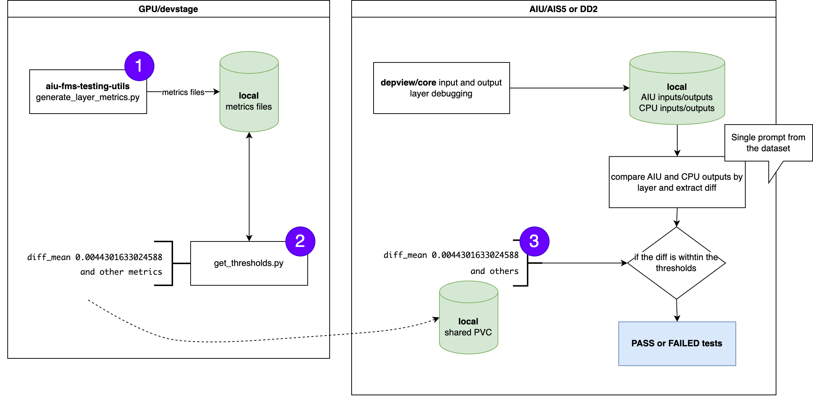
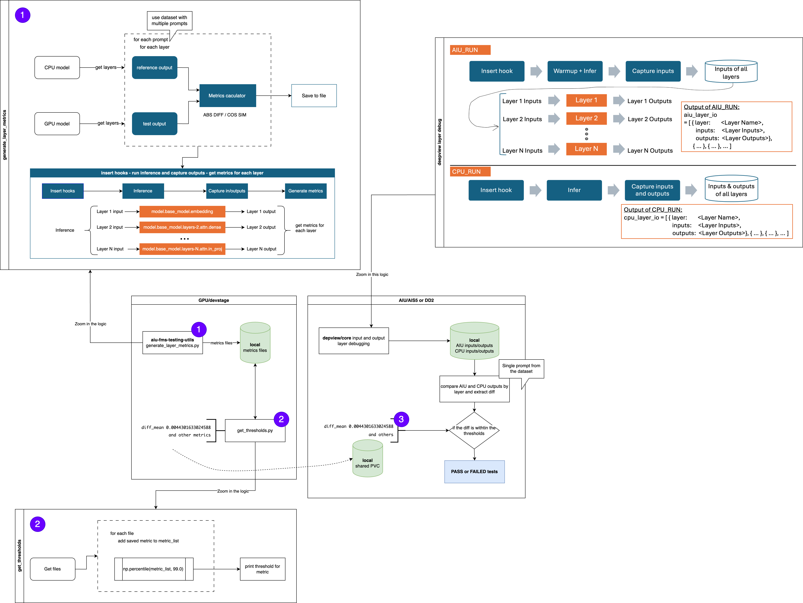

# Layer Metrics Generation

Generate metrics by layers to be used in tests and model enablement debugging. 

1. [Generate metrics by layer in GPU](./LAYERS.md#1-generate-metrics-by-layer)
2. [Get Thresholds](./LAYERS.md#2-get-thresholds)
3. [Apply metrics where needed](./LAYERS.md#3-apply-the-thresholds-where-needed)

The steps as part of the diagram below:

To see the full integration with other debugging tools, check [item 3](./LAYERS.md#3-apply-the-thresholds-where-needed).

## 1. Generate Metrics by Layer

The idea is to run, the prompts through the model with the pre- and post-hooks added, and then get the metrics for the outputs intercepted by each layer, as in this diagram. Then we can have a baseline with CPU/GPU for a failure threshold in AIU tests. Same idea as the [test_decoders.py](https://github.com/foundation-model-stack/aiu-fms-testing-utils/blob/main/tests/models/test_decoders.py), but for each layer. This way we can measure the discrepancies for the outputs and use the thresholds for detailed debugging problems in AIU.


The script [generate_layers_metrics.py](../scripts/generate_layers_metrics.py) requires the following arguments to be run:

```bash
usage: generate_layers_metrics.py [-h] [--architecture ARCHITECTURE] [--variant VARIANT] [--model_path MODEL_PATH] --mode {generate,model-forward} --batch_sizes BATCH_SIZES --seq_lengths SEQ_LENGTHS --max_new_tokens MAX_NEW_TOKENS [--output_path OUTPUT_PATH] [--sharegpt_path SHAREGPT_PATH]

Script to generate the model's metrics by layer

options:
  -h, --help            show this help message and exit
  --architecture ARCHITECTURE
                        The model architecture Eg.: hf_pretrained
  --variant VARIANT     The model variants (configuration) to benchmark. E.g. ibm-granite/granite-3.2-8b-instruct
  --model_path MODEL_PATH
                        Paths to the directory containing model's weights (.pth files sharded by tensor parallel rank, not HF weights)
  --mode {generate,model-forward}
                        Sets the output generation mode.
  --batch_sizes BATCH_SIZES
                        Batch sizes separated by comma. Eg.: 1,2
  --seq_lengths SEQ_LENGTHS
                        Sequence lengths separated by comma. Eg.: 64,2048
  --max_new_tokens MAX_NEW_TOKENS
                        Max number of generated tokens separated by comma. Eg.: 64,128
  --output_path OUTPUT_PATH
                        Path to save output files
  --sharegpt_path SHAREGPT_PATH
                        Path to sharegpt data json
```

These variables support single and array values.

The argument required for this script is the `--mode`, which is the generation mode desired for the output; The choices can be `generate` or `model-forward`.
- `generate` uses FMS [generate](../scripts/generate_layers_metrics.py#L118); It’s a high-level API that wraps many operations: forward pass, KV cache logic, sampling or greeting decoding, post-processing. 
```python
result = generate(
    model,
    ids,
    max_new_tokens=max_new_tokens,
    use_cache=use_cache,
    do_sample=do_sample,
    max_seq_len=max_seq_len,
    timing="e2e",
    eos_token_id=None,
    contiguous_cache=True,
    extra_kwargs={},
)
```
- `model-forward` will call [model.forward](../scripts/generate_layers_metrics.py#L135); Avoids introducing noise from sampling, past key caching, etc.
```python
result = model.forward(
    ids,
    use_cache=use_cache
    )
```

### How to run

Once all is set up, we can generate the CSV metrics:

```bash
cd aiu-fms-testing-utils/tests/resources

mkdir /tmp/output

python3 generate_layers_metrics.py --mode model-forward --variant ibm-granite/granite-3.2-8b-instruct --architecture hf_pretrained --batch_sizes 1 --seq_lengths 64 --max_new_tokens 128
```
The files should get created at `/tmp/output` dir:
```bash
ibm-granite--granite-3.2-8b-instruct_max-new-tokens-128_batch-size-1_seq-length-64_dtype-float16--model.base_model.layers7.ln.abs_diff.csv
ibm-granite--granite-3.2-8b-instruct_max-new-tokens-128_batch-size-1_seq-length-64_dtype-float16--model.base_model.layers7.ln.cos_sim.csv
ibm-granite--granite-3.2-8b-instruct_max-new-tokens-128_batch-size-1_seq-length-64_dtype-float16--model.base_model.layers8.attn.dense.abs_diff.csv
ibm-granite--granite-3.2-8b-instruct_max-new-tokens-128_batch-size-1_seq-length-64_dtype-float16--model.base_model.layers8.attn.dense.cos_sim.csv
```

## 2. Get Thresholds

To get the second step of the flow and get the thresholds by layer, run:
```bash
cd /aiu-fms-testing-utils/tests/resources

python3 get_thresholds.py --models ibm-granite/granite-3.2-8b-instruct --metrics abs_diff cos_sim_avg cos_sim_men --file_base /tmp/output --layer_io
```
It should print the metric of each layer:
```bash
2025-07-09 19:02:40,657 found 484 layers metric files
2025-07-09 19:02:40,674 Layer model.base_model.embedding abs_diff_linalg_norm = 1.7258892434335918e-07
2025-07-09 19:02:40,690 Layer model.base_model.layers0.ln abs_diff_linalg_norm = 0.4083323414747196
2025-07-09 19:02:40,707 Layer model.base_model.layers0.attn.in_proj.query abs_diff_linalg_norm = 0.7099368339133884
2025-07-09 19:02:40,712 Layer model.base_model.layers0.attn.in_proj.key abs_diff_linalg_norm = 0.40915828503373886
2025-07-09 19:02:40,716 Layer model.base_model.layers0.attn.in_proj.value abs_diff_linalg_norm = 0.12381335209555287
2025-07-09 19:02:40,721 Layer model.base_model.layers0.attn.in_proj abs_diff_linalg_norm = 0.12381335209555287
[...]
2025-07-09 19:03:27,029 Layer model.base_model.layers39.attn.in_proj.value cos_sim_avg = 0.9999685110524297
2025-07-09 19:03:27,029 Layer model.base_model.layers39.attn.in_proj cos_sim_avg = 0.9999685110524297
2025-07-09 19:03:27,029 Layer model.base_model.layers39.attn.dense cos_sim_avg = 0.9999954961240292
2025-07-09 19:03:27,029 Layer model.base_model.layers39.ff_ln cos_sim_avg = 1.0000354265794158
2025-07-09 19:03:27,029 Layer model.base_model.layers39.ff_sub_layer.wg cos_sim_avg = 1.0000474276021123
2025-07-09 19:03:27,029 Layer model.base_model.layers39.ff_sub_layer.a cos_sim_avg = 1.0000188555568457
[...]
2025-07-09 19:03:27,055 Layer model.base_model.layers0.attn.in_proj.query cos_sim_mean = 0.9999569654464722
2025-07-09 19:03:27,055 Layer model.base_model.layers0.attn.in_proj.key cos_sim_mean = 1.000030318275094
2025-07-09 19:03:27,055 Layer model.base_model.layers0.attn.in_proj.value cos_sim_mean = 0.9999886471778154
2025-07-09 19:03:27,055 Layer model.base_model.layers0.attn.in_proj cos_sim_mean = 0.9999886471778154
2025-07-09 19:03:27,055 Layer model.base_model.layers0.attn.dense cos_sim_mean = 1.0000049602240324
2025-07-09 19:03:27,055 Layer model.base_model.layers0.ff_ln cos_sim_mean = 0.9999961135908961

```
Also, a JSON file is saved to the same output dir. A sample file can be found at: [sample_layer_th.json](https://github.com/flaviabeo/aiu-fms-testing-utils/blob/generate_metrics_layers/tests/resources/sample_layer_th.json)

## 3. Apply the thresholds where needed

In case of AIU debugging tools, the thresholds will be applied to compare AIU outputs with CPU, and then assert if the differences are within the thresholds generated. Below, is an architecture of the full integration:


The box named `deepview layer debug` has the diagram of how the model layers outputs are generated to be compared against the CPU results. This is important so that the debug tools can catch operations and layers that have issues in their enablement for AIU hardware.