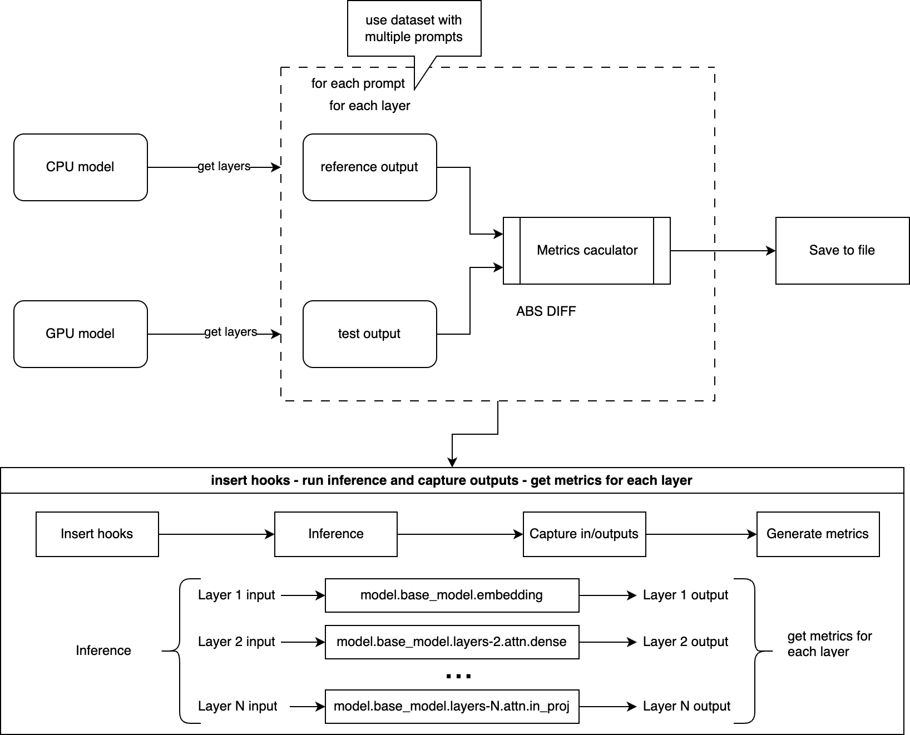

# Layer Metrics Generation

This guide explains how to use the [`generate_layers_metrics.py`](../scripts/generate_layers_metrics.py) script to generate metrics by layer for validating models and debugging.

1. [Generate metrics by layer](./LAYERS.md#1-generate-metrics-by-layer)
2. [Get thresholds](./LAYERS.md#2-get-thresholds)
3. [Apply thresholds](./LAYERS.md#3-apply-the-thresholds)

## 1. Generate Metrics by Layer

The goal is to run prompts through the model with pre- and post-hooks added, allowing us to capture output metrics at each layer. This approach lets us establish a CPU/GPU baseline to define failure thresholds for AIU tests, similar to [test_decoders.py](https://github.com/foundation-model-stack/aiu-fms-testing-utils/blob/main/tests/models/test_decoders.py), but applied at each layer. This helps to measure the output discrepancies and use the thresholds for debugging problems on AIU.



### Script Usage

```console
usage: generate_layers_metrics.py [-h] 
    [--architecture ARCHITECTURE] 
    [--variant VARIANT] 
    [--model_path MODEL_PATH] 
    --mode {generate,model-forward} 
    --batch_sizes BATCH_SIZES 
    --seq_lengths SEQ_LENGTHS 
    --max_new_tokens MAX_NEW_TOKENS 
    [--output_path OUTPUT_PATH] 
    [--sharegpt_path SHAREGPT_PATH]

Script to generate the model's metrics by layer

options:
  -h, --help            show this help message and exit
  --architecture ARCHITECTURE
                        The model architecture Eg.: hf_pretrained
  --variant VARIANT     The model variants (configuration) to benchmark. E.g. ibm-granite/granite-3.3-8b-instruct
  --model_path MODEL_PATH
                        Paths to the directory containing model's weights (.pth files sharded by tensor parallel rank, not HF weights)
  --mode {generate,model-forward}
                        Sets the output generation mode.
  --batch_sizes BATCH_SIZES
                        Batch sizes separated by comma. Eg.: 1,2
  --seq_lengths SEQ_LENGTHS
                        Sequence lengths separated by comma. Eg.: 64,2048
  --max_new_tokens MAX_NEW_TOKENS
                        Max number of generated tokens separated by comma. Eg.: 64,128
  --output_path OUTPUT_PATH
                        Path to save output files
  --sharegpt_path SHAREGPT_PATH
                        Path to sharegpt data json
```

The only required argument is `--mode`, which sets the type of generation to be used. The options are `generate` or `model-forward`.

- `generate` uses [FMS' generate](https://github.com/foundation-model-stack/foundation-model-stack/blob/main/fms/utils/generation.py) function, a high-level API that wraps many operations (e.g. forward pass, KV cache logic, decoding, post-processing).

```python
result = generate(
    model,
    ids,
    max_new_tokens=max_new_tokens,
    use_cache=use_cache,
    do_sample=do_sample,
    max_seq_len=max_seq_len,
    timing="e2e",
    eos_token_id=None,
    contiguous_cache=True,
    extra_kwargs={},
)
```

- `model-forward` calls `model.forward` directly, avoiding introducing noise from sampling, past key caching, etc.

```python
result = model.forward(
    ids,
    use_cache=use_cache
    )
```

#### How to Run

To run the script to generate CSV metrics for each layer of the model, first create a directory to hold the output files:

```bash
cd aiu-fms-testing-utils/tests/resources
mkdir /tmp/output
```

Then, run the script:

```bash
python3 generate_layers_metrics.py --mode model-forward --variant ibm-granite/granite-3.3-8b-instruct --architecture hf_pretrained --batch_sizes 1 --seq_lengths 64 --max_new_tokens 128
```

CSV files will be generated under `/tmp/output`, unless `--output_path` was specified:

```bash
ibm-granite--granite-3.3-8b-instruct_max-new-tokens-128_batch-size-1_seq-length-64_dtype-float16--model.base_model.layers7.ln.abs_diff.csv
ibm-granite--granite-3.3-8b-instruct_max-new-tokens-128_batch-size-1_seq-length-64_dtype-float16--model.base_model.layers7.ln.cos_sim.csv
ibm-granite--granite-3.3-8b-instruct_max-new-tokens-128_batch-size-1_seq-length-64_dtype-float16--model.base_model.layers8.attn.dense.abs_diff.csv
ibm-granite--granite-3.3-8b-instruct_max-new-tokens-128_batch-size-1_seq-length-64_dtype-float16--model.base_model.layers8.attn.dense.cos_sim.csv
```

## 2. Get Thresholds

Once the layer-wise metrics are generated, you can compute the thresholds for each layer to serve as baseline metrics.

Run the [`get_thresholds.py`](./resources/get_thresholds.py) script:

```bash
cd aiu-fms-testing-utils/tests/resources

python3 get_thresholds.py --models ibm-granite/granite-3.3-8b-instruct --metrics abs_diff cos_sim_avg cos_sim_men --file_base /tmp/output --layer_io
```

You’ll see output like this, showing the computed metrics per layer:

```bash
2025-07-09 19:02:40,657 found 484 layers metric files
2025-07-09 19:02:40,674 Layer model.base_model.embedding abs_diff_linalg_norm = 1.7258892434335918e-07
2025-07-09 19:02:40,690 Layer model.base_model.layers0.ln abs_diff_linalg_norm = 0.4083323414747196
2025-07-09 19:02:40,707 Layer model.base_model.layers0.attn.in_proj.query abs_diff_linalg_norm = 0.7099368339133884
2025-07-09 19:02:40,712 Layer model.base_model.layers0.attn.in_proj.key abs_diff_linalg_norm = 0.40915828503373886
2025-07-09 19:02:40,716 Layer model.base_model.layers0.attn.in_proj.value abs_diff_linalg_norm = 0.12381335209555287
2025-07-09 19:02:40,721 Layer model.base_model.layers0.attn.in_proj abs_diff_linalg_norm = 0.12381335209555287
[...]
2025-07-09 19:03:27,029 Layer model.base_model.layers39.attn.in_proj.value cos_sim_avg = 0.9999685110524297
2025-07-09 19:03:27,029 Layer model.base_model.layers39.attn.in_proj cos_sim_avg = 0.9999685110524297
2025-07-09 19:03:27,029 Layer model.base_model.layers39.attn.dense cos_sim_avg = 0.9999954961240292
2025-07-09 19:03:27,029 Layer model.base_model.layers39.ff_ln cos_sim_avg = 1.0000354265794158
2025-07-09 19:03:27,029 Layer model.base_model.layers39.ff_sub_layer.wg cos_sim_avg = 1.0000474276021123
2025-07-09 19:03:27,029 Layer model.base_model.layers39.ff_sub_layer.a cos_sim_avg = 1.0000188555568457
[...]
2025-07-09 19:03:27,055 Layer model.base_model.layers0.attn.in_proj.query cos_sim_mean = 0.9999569654464722
2025-07-09 19:03:27,055 Layer model.base_model.layers0.attn.in_proj.key cos_sim_mean = 1.000030318275094
2025-07-09 19:03:27,055 Layer model.base_model.layers0.attn.in_proj.value cos_sim_mean = 0.9999886471778154
2025-07-09 19:03:27,055 Layer model.base_model.layers0.attn.in_proj cos_sim_mean = 0.9999886471778154
2025-07-09 19:03:27,055 Layer model.base_model.layers0.attn.dense cos_sim_mean = 1.0000049602240324
2025-07-09 19:03:27,055 Layer model.base_model.layers0.ff_ln cos_sim_mean = 0.9999961135908961

```

A `JSON` summary file containing these thresholds is also saved in the same output directory. An example of this file can be found here: [sample_layer_th.json](./resources/sample_layer_th.json).

## 3. Apply the Thresholds

The thresholds serve as bounds to determine whether AIU outputs diverge from CPU.

**TODO:** Add integration architecture
